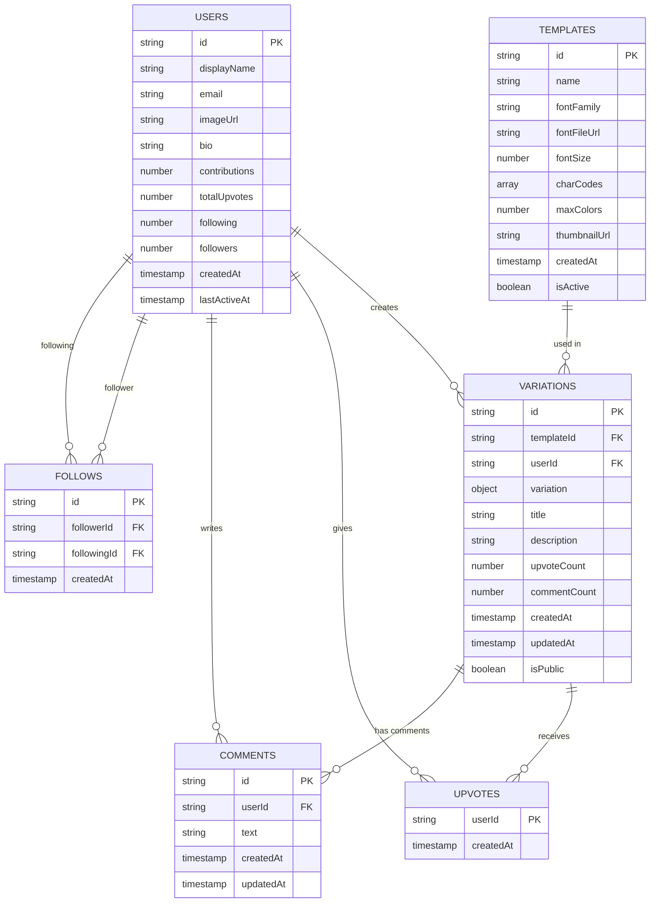

# Colartive App - Firestore Database Schema

## 🗄️ Database Structure Overview

### **Simplified Collection Structure**

```
Firestore Database: colartive-app
│
├── 📁 templates/
│   └── 📄 {templateId}
│       ├── id: string
│       ├── name: string
│       ├── fontFamily: string
│       ├── fontFileUrl: string (Firebase Storage URL)
│       ├── fontSize: number
│       ├── charCodes: array<int>
│       ├── maxColors: number
│       ├── thumbnailUrl: string (Firebase Storage URL)
│       ├── createdAt: timestamp
│       └── isActive: boolean
│
├── 📁 users/
│   └── 📄 {userId} (Auth UID)
│       ├── id: string
│       ├── displayName: string
│       ├── email: string
│       ├── imageUrl: string (Firebase Storage URL)
│       ├── bio: string
│       ├── contributions: number
│       ├── totalUpvotes: number
│       ├── following: number
│       ├── followers: number
│       ├── createdAt: timestamp
│       └── lastActiveAt: timestamp
│
├── 📁 variations/
│   └── 📄 {variationId}
│       ├── id: string
│       ├── templateId: string (→ templates/{templateId})
│       ├── userId: string (→ users/{userId})
│       ├── variation: object
│       │   ├── colors: array<int> (ARGB values)
│       │   ├── scaleFactor: number
│       │   ├── rotationFactor: number
│       │   ├── blurFactor: number
│       │   └── overlayTexts: array<object>
│       ├── title: string
│       ├── description: string
│       ├── upvoteCount: number
│       ├── commentCount: number
│       ├── createdAt: timestamp
│       ├── updatedAt: timestamp
│       ├── isPublic: boolean
│       ├── 📁 upvotes/ (subcollection)
│       │   └── 📄 {userId}
│       │       ├── userId: string (→ users/{userId})
│       │       └── createdAt: timestamp
│       └── 📁 comments/ (subcollection)
│           └── 📄 {commentId}
│               ├── id: string
│               ├── userId: string (→ users/{userId})
│               ├── text: string
│               ├── createdAt: timestamp
│               └── updatedAt: timestamp
│
└── 📁 follows/
    └── 📄 {followId}
        ├── id: string
        ├── followerId: string (→ users/{userId})
        ├── followingId: string (→ users/{userId})
        └── createdAt: timestamp
```


## 🔗 Relationships Diagram



## 🔍 Composite Indexes Required

```javascript
// Firestore Composite Indexes
{
  // For unique follows per user relationship
  collection: "follows", 
  fields: [
    { fieldPath: "followerId", order: "ASCENDING" },
    { fieldPath: "followingId", order: "ASCENDING" }
  ]
},
{
  // For querying variations by template
  collection: "variations",
  fields: [
    { fieldPath: "templateId", order: "ASCENDING" },
    { fieldPath: "createdAt", order: "DESCENDING" }
  ]
},
{
  // For querying user's variations
  collection: "variations",
  fields: [
    { fieldPath: "userId", order: "ASCENDING" },
    { fieldPath: "createdAt", order: "DESCENDING" }
  ]
},
{
  // For querying public variations
  collection: "variations",
  fields: [
    { fieldPath: "isPublic", order: "ASCENDING" },
    { fieldPath: "createdAt", order: "DESCENDING" }
  ]
},
{
  // For querying public variations by template
  collection: "variations",
  fields: [
    { fieldPath: "templateId", order: "ASCENDING" },
    { fieldPath: "isPublic", order: "ASCENDING" },
    { fieldPath: "createdAt", order: "DESCENDING" }
  ]
}
```

## 🗂️ Firebase Storage Structure

```
gs://colartive-app.appspot.com/
│
├── 📁 templates/
│   └── 📁 {templateId}/
│       ├── 🖼️ thumbnail.png
│       └── 🔤 font.ttf (if custom)
│
└── 📁 users/
    └── 📁 {userId}/
        └── 🖼️ profile.jpg
```

### **🎨 Dynamic Canvas Rendering**
Instead of storing variation images, render them on-demand:
- **Template** + **Variation** = Real-time canvas painting
- ✅ **Zero storage cost** for variation images  
- ✅ **Always fresh** - no stale cached images
- ✅ **Instant sharing** - no upload delays

## 🚀 Optimized Query Examples

#### Home View - Get All Templates
```dart
FirebaseFirestore.instance
  .collection('templates')
  .where('isActive', isEqualTo: true)
  .orderBy('createdAt', descending: true)
  .get()
```

#### Canvas Live - Get Variations for Specific Template
```dart
FirebaseFirestore.instance
  .collection('variations')
  .where('templateId', isEqualTo: templateId)
  .where('isPublic', isEqualTo: true)
  .orderBy('createdAt', descending: true)
  .limit(20)
  .get()
```

#### Profile View - Get User's Variations
```dart
FirebaseFirestore.instance
  .collection('variations')
  .where('userId', isEqualTo: userId)
  .orderBy('createdAt', descending: true)
  .get()
```

#### Global Feed - All Public Variations
```dart
FirebaseFirestore.instance
  .collection('variations')
  .where('isPublic', isEqualTo: true)
  .orderBy('createdAt', descending: true)
  .limit(50)
  .get()
```

#### Social Features - Check if User Liked Variation
```dart
FirebaseFirestore.instance
  .collection('variations')
  .doc(variationId)
  .collection('upvotes')
  .doc(currentUserId)
  .get()
```

#### Get Comments for a Variation
```dart
FirebaseFirestore.instance
  .collection('variations')
  .doc(variationId)
  .collection('comments')
  .orderBy('createdAt', descending: true)
  .get()
```

## ✍️ Optimized Write Strategy (No Image Storage)

When a user shares a variation, only store the variation data:

```dart
// Prepare variation data (no imageUrl needed!)
final variationData = {
  'id': variationId,
  'templateId': templateId,  
  'userId': userId,
  'variation': variation.toMap(), // Colors, scale, rotation, blur, overlayTexts
  'title': title,
  'description': description,
  'upvoteCount': 0,
  'commentCount': 0,
  'createdAt': FieldValue.serverTimestamp(),
  'updatedAt': FieldValue.serverTimestamp(),
  'isPublic': isPublic,
};

// 1. Write to variations collection
await FirebaseFirestore.instance
  .collection('variations')
  .doc(variationId)
  .set(variationData);

// 2. Update user's contribution counter using transactions
await FirebaseFirestore.instance.runTransaction((transaction) async {
  transaction.update(
    FirebaseFirestore.instance.collection('users').doc(userId),
    {'contributions': FieldValue.increment(1)}
  );
});
```

### **Benefits of Dynamic Rendering + Single Collection:**
✅ **Simple Architecture** - Single variations collection, easy to manage
✅ **Zero Image Storage Cost** - No Firebase Storage usage for variations
✅ **Instant Sharing** - No image upload delays  
✅ **Always Fresh** - No stale cached images
✅ **Efficient Queries** - Composite indexes for fast filtering
✅ **Real-time Canvas** - Paint variations on-demand
✅ **Organized Social Features** - Upvotes and comments as subcollections

### **Trade-offs:**
❌ **Query Complexity** - Need composite indexes for multi-field queries
❌ **CPU Usage** - Canvas painting on each view (minimal impact)


## 📊 Optimized Data Flow Summary

1. **Authentication**: Firebase Auth → User document created/updated
2. **Templates**: Admin uploads → Firestore + Storage (thumbnail + font)
3. **Canvas Creation**: User creates variation → In-memory only
4. **Sharing**: User shares → Firestore document (variation data only, no image)
5. **Canvas Display**: Fetch template + variation → Real-time canvas painting
6. **Social Actions**: Like/Comment → Update counters in variation document
7. **Profile**: Query user's variations + render thumbnails dynamically

### **🎨 Canvas Rendering Flow:**
```
Template (font + charCodes) + Variation (colors + transforms) 
                    ↓
            TemplatePainter.paint()
                    ↓  
            Real-time Canvas Display
```

This optimized schema provides:
- **🏗️ Simple architecture** with single variations collection
- **💰 Zero storage cost** for variation images  
- **⚡ Instant sharing** with no upload delays
- **🔄 Always fresh** dynamic rendering
- **📊 Organized social features** with subcollections for upvotes and comments